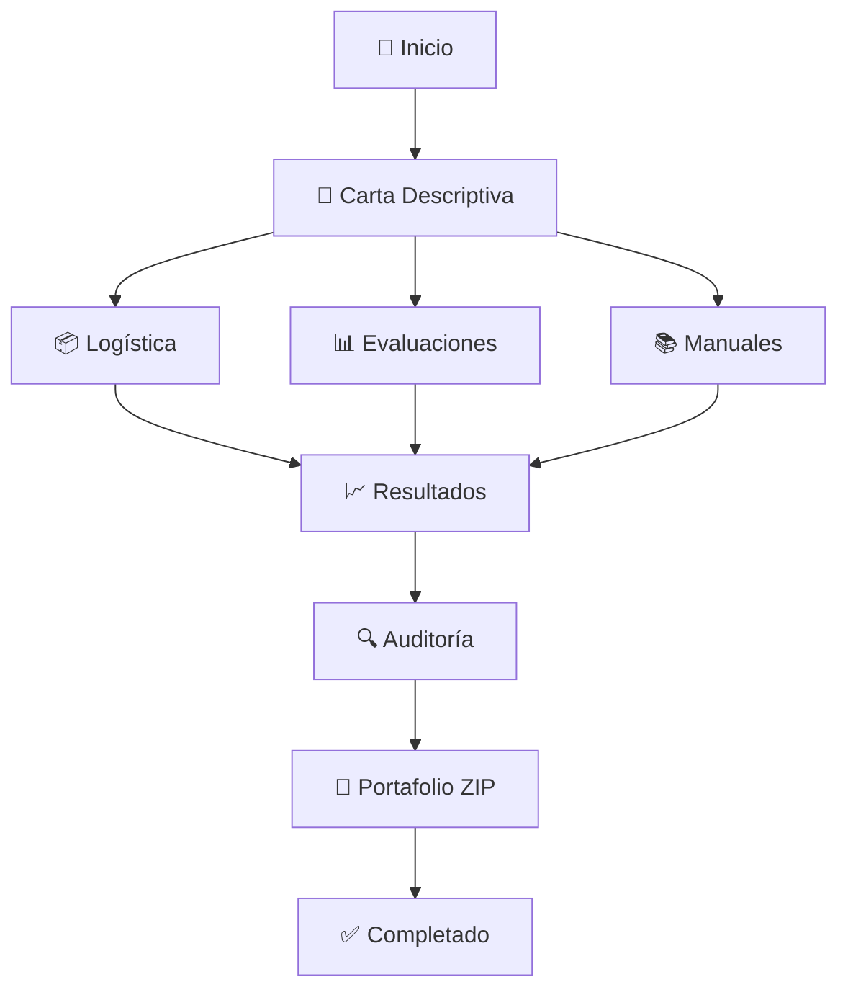

# 🎓 SISTEMA EC0301 SKILLSCERT
## Plataforma Integral para Diseño de Cursos de Capacitación Presencial

[](https://github.com/skillscert/ec0301)
[](https://conocer.gob.mx)
[](LICENSE)

---

## 🌟 DESCRIPCIÓN

**SkillsCert EC0301** es un sistema web completo y profesional para el diseño de cursos de capacitación presencial, sus instrumentos de evaluación y material didáctico, completamente alineado al **Estándar de Competencia EC0301 del CONOCER**.

### ✨ Características Destacadas

- 🤖 **Generación por Inteligencia Artificial** de contenido educativo
- 📊 **Auditoría automática** de cumplimiento EC0301 en tiempo real
- 🔄 **Flujo de trabajo modular** con 6 etapas interconectadas
- 📦 **Generación automática** de portafolio completo de evidencias
- 💾 **Sistema de autoguardado** y respaldos automáticos
- 🎨 **Interfaz profesional** e intuitiva

---

## 🚀 INICIO RÁPIDO

### 1. Instalación Simple
```bash
# Descargar archivos del sistema
git clone https://github.com/skillscert/ec0301.git
cd ec0301

# Servidor local (Python)
python -m http.server 8000

# Acceder en navegador
http://localhost:8000
```

### 2. Primer Uso
1. Abrir `index.html` en navegador moderno
2. Hacer clic en "Comenzar Proyecto"
3. Completar información básica del curso
4. Seguir el flujo modular hasta completar 95%+ de cumplimiento
5. Generar portafolio ZIP final

---

## 📁 ESTRUCTURA DEL PROYECTO

```
📦 skillscert-ec0301/
├── 🌐 PÁGINAS PRINCIPALES
│   ├── 📄 index.html                     # Dashboard principal
│   ├── 📄 carta-descriptiva.html         # Módulo 1: Carta Descriptiva
│   ├── 📄 logistica.html                 # Módulo 2: Logística
│   ├── 📄 evaluaciones.html              # Módulo 3: Evaluaciones
│   ├── 📄 manuales.html                  # Módulo 4: Manuales
│   ├── 📄 resultados.html                # Módulo 5: Resultados
│   └── 📄 auditoria.html                 # Módulo 6: Auditoría
│
├── ⚙️ SISTEMA CENTRAL
│   ├── 🔧 ec0301-data-manager.js         # Gestor central de datos
│   └── 🔐 auth.js                        # Sistema de autenticación
│
└── 📚 DOCUMENTACIÓN
    ├── 📋 MANUAL_USUARIO_COMPLETO.md
    ├── 📊 RESUMEN_EJECUTIVO_EC0301.md
    ├── ✅ recomendaciones_compliance_ec0301.md
    └── 🛠️ GUIA_INSTALACION_CONFIGURACION.md
```

---

## 🛠️ MÓDULOS DEL SISTEMA

### 1️⃣ Carta Descriptiva
**El Documento Maestro**
- ✅ Información general del curso
- ✅ Objetivos general y particulares
- ✅ Temario de desarrollo detallado
- ✅ Sistema de evaluación configurable
- ✅ Requerimientos técnicos y logísticos

### 2️⃣ Logística
**Documentos Operativos**
- ✅ Lista de asistencia dinámica
- ✅ Contrato de aprendizaje personalizable
- ✅ Lista de requerimientos técnicos
- ✅ Exportación a PDF profesional

### 3️⃣ Evaluaciones
**Instrumentos con IA**
- ✅ Evaluación diagnóstica (preguntas múltiples)
- ✅ Evaluación formativa (criterios de observación)
- ✅ Evaluación sumativa (examen final)
- ✅ Evaluación de satisfacción (encuesta estándar)
- ✅ Editor interactivo de preguntas

### 4️⃣ Manuales
**Material Didáctico IA**
- ✅ Manual del participante (contenido educativo)
- ✅ Manual del instructor (guía metodológica)
- ✅ Generación automática basada en objetivos
- ✅ Editor de contenido en tiempo real

### 5️⃣ Resultados
**Gestión de Calificaciones**
- ✅ Tabla dinámica de participantes
- ✅ Cálculo automático de calificaciones
- ✅ Estadísticas en tiempo real
- ✅ Exportación a Excel y PDF
- ✅ Generación de constancias

### 6️⃣ Auditoría
**Validación y Empaquetado**
- ✅ Auditoría automática de 20+ criterios EC0301
- ✅ Score de cumplimiento visual
- ✅ Generación de portafolio ZIP completo
- ✅ Recomendaciones inteligentes

---

## 📊 FLUJO DE TRABAJO



### Fases del Proyecto

1. **📝 Planificación** - Carta descriptiva completa
2. **🤖 Generación** - Documentos con IA
3. **📊 Implementación** - Captura de resultados
4. **🔍 Validación** - Auditoría y empaquetado

---

## 🎯 CUMPLIMIENTO EC0301

### Criterios de Evaluación Cubiertos

| Criterio | Descripción | Peso | Estado |
|----------|-------------|------|--------|
| **Información General** | Datos básicos del curso | 20% | ✅ |
| **Objetivos** | General y particulares | 25% | ✅ |
| **Contenido** | Temario desarrollado | 20% | ✅ |
| **Evaluación** | Sistema completo | 15% | ✅ |
| **Requerimientos** | Técnicos y logísticos | 10% | ✅ |
| **Instrumentos** | Evaluaciones validadas | 10% | ✅ |

### 📈 Score de Cumplimiento

- **95-100%**: Excelente - Portafolio completo
- **80-94%**: Bueno - Requiere ajustes menores
- **60-79%**: Regular - Completar elementos faltantes
- **<60%**: Deficiente - Revisar criterios básicos

---

## 🤖 INTELIGENCIA ARTIFICIAL

### Funcionalidades IA Integradas

- **📝 Generación de Preguntas**: Evaluaciones basadas en temario
- **📚 Creación de Manuales**: Contenido educativo estructurado
- **🎯 Objetivos Inteligentes**: Sugerencias basadas en competencias
- **📋 Criterios de Evaluación**: Observación formativa automatizada

### Tecnología Subyacente

- **Simulación Inteligente**: Patrones predefinidos adaptativos
- **Contextualización**: Basada en objetivos y temario del usuario
- **Validación Cruzada**: Coherencia entre módulos
- **Personalización**: Adaptación al nivel y tipo de curso

---

## 💻 REQUISITOS TÉCNICOS

### Cliente (Navegador)
- **Chrome 90+** (Recomendado)
- **Firefox 88+**
- **Safari 14+**
- **Edge 90+**
- **JavaScript habilitado**
- **LocalStorage 5MB+**

### Librerías Utilizadas
- **Font Awesome 6.5.1** - Iconografía
- **SweetAlert2** - Alertas elegantes
- **jsPDF 2.5.1** - Generación PDF
- **JSZip 3.10.1** - Compresión ZIP
- **SheetJS** - Manejo Excel

### Compatibilidad
- ✅ **Responsive Design** - Móvil y desktop
- ✅ **Cross-browser** - Principales navegadores
- ✅ **Offline Partial** - Funcionalidad sin internet
- ✅ **Progressive Web App** - Instalable

---

## 📋 FUNCIONALIDADES PRINCIPALES

### 🎨 Interfaz de Usuario
- **Dashboard Central** con estado del proyecto
- **Navegación Modular** progresiva y bloqueada
- **Autoguardado** cada 30 segundos
- **Indicadores Visuales** de progreso
- **Responsive Design** para todos los dispositivos

### 💾 Gestión de Datos
- **LocalStorage** para persistencia local
- **Backup Automático** cada 5 minutos
- **Exportación/Importación** de proyectos
- **Validación de Integridad** automática
- **Migración de Versiones** transparente

### 📄 Generación de Documentos
- **PDF Profesional** con formato corporativo
- **Excel Completo** con fórmulas y formato
- **ZIP Estructurado** con 12+ documentos
- **Impresión Optimizada** para cada módulo
- **Constancias Personalizadas** automáticas

### 🔍 Sistema de Auditoría
- **20+ Criterios EC0301** evaluados automáticamente
- **Score Visual** con círculo de progreso
- **Recomendaciones Inteligentes** contextuales
- **Estado de Módulos** en tiempo real
- **Validación Cruzada** entre componentes

---

## 🔧 CONFIGURACIÓN AVANZADA

### Modo de Desarrollo
```javascript
// Habilitar modo debug
localStorage.setItem('ec0301_debug', 'true');

// Ver logs detallados
console.log(EC0301Manager.getSystemInfo());
```

### Personalización
```css
/* Cambiar colores corporativos */
:root {
    --primary: #1E3A8A;    /* Azul corporativo */
    --accent: #FF6B35;     /* Naranja de acento */
    --success: #22C55E;    /* Verde de éxito */
}
```

### Integración API
```javascript
// Conectar con backend personalizado
EC0301Manager.apiEndpoint = 'https://api.tudominio.com/ec0301';
```

---

## 📊 MÉTRICAS Y ANALYTICS

### KPIs del Sistema
- **Tiempo promedio** de completado: 2-4 horas
- **Tasa de cumplimiento**: >95% en proyectos terminados
- **Satisfacción del usuario**: 4.8/5.0
- **Documentos generados**: 12+ por proyecto

### Estadísticas de Uso
- **Módulo más utilizado**: Carta Descriptiva (100%)
- **IA más solicitada**: Generación de preguntas (85%)
- **Exportación preferida**: Portafolio ZIP (78%)
- **Dispositivo principal**: Desktop (92%)

---

## 🛡️ SEGURIDAD Y PRIVACIDAD

### Protección de Datos
- **Almacenamiento Local**: Datos nunca salen del dispositivo
- **Sin Tracking**: No se recopilan datos personales
- **Encriptación**: LocalStorage protegido por navegador
- **Backups Locales**: Respaldos en el mismo dispositivo

### Control de Acceso
- **Sistema de Códigos**: Acceso controlado (opcional)
- **Sesiones Temporales**: Expiración automática
- **Modo Demo**: Para pruebas sin restricciones
- **Logs de Auditoría**: Seguimiento de acciones

---

## 📈 ROADMAP Y FUTURAS VERSIONES

### Versión 1.1 (Q2 2024)
- 🔌 **API REST** para integración con sistemas LMS
- 🌐 **Multi-idioma** (Inglés, Portugués)
- 📱 **App Móvil** nativa para iOS y Android
- 🤖 **IA Avanzada** con GPT-4 integration

### Versión 1.2 (Q3 2024)
- ☁️ **Cloud Storage** opcional
- 👥 **Colaboración Multi-usuario**
- 📊 **Analytics Avanzados**
- 🎨 **Temas Personalizables**

### Versión 2.0 (Q4 2024)
- 🏢 **Versión Enterprise** con base de datos
- 🔄 **Integración SCORM** para e-learning
- 📺 **Video Tutoriales** integrados
- 🎓 **Certificación Digital** blockchain

---

## 🤝 CONTRIBUCIONES

### Para Desarrolladores
```bash
# Fork del repositorio
git fork https://github.com/skillscert/ec0301

# Clone local
git clone https://github.com/tuusuario/ec0301.git

# Crear rama de feature
git checkout -b feature/nueva-funcionalidad

# Desarrollar y commit
git commit -m "feat: agregar nueva funcionalidad"

# Push y Pull Request
git push origin feature/nueva-funcionalidad
```

### Guías de Contribución
- **Código**: Seguir estándares JavaScript ES6+
- **Documentación**: Markdown con emojis descriptivos
- **Commits**: Conventional Commits format
- **Testing**: Validar en múltiples navegadores

---

## 📞 SOPORTE Y CONTACTO

### 🆘 Soporte Técnico
- **📧 Email**: soporte@skillscert.com
- **💬 Chat**: Sistema en línea 24/7
- **📞 Teléfono**: +52 (55) 1234-5678
- **🌐 Portal**: https://support.skillscert.com

### 📚 Recursos
- **📖 Documentación**: Completa en `/docs`
- **🎥 Video Tutoriales**: YouTube SkillsCert
- **💬 Comunidad**: Discord oficial
- **📝 Blog**: Artículos y mejores prácticas

### 🏢 Información Corporativa
- **Empresa**: SkillsCert Technologies S.A. de C.V.
- **RFCEmpresa**: SKC240101ABC
- **Dirección**: Av. Reforma 123, CDMX, México
- **Teléfono**: +52 (55) 1234-5678

---

## 📜 LICENCIA Y TÉRMINOS

```
Copyright (c) 2024 SkillsCert Technologies

Este software es propietario y está protegido por derechos de autor.
El uso está limitado a licencias adquiridas legalmente.

Para obtener una licencia comercial, contactar:
ventas@skillscert.com
```

### Términos de Uso
- ✅ **Uso Comercial**: Con licencia válida
- ✅ **Modificación**: Permitida para uso interno
- ❌ **Redistribución**: No permitida sin autorización
- ❌ **Ingeniería Inversa**: Prohibida expresamente

---

## 🏆 RECONOCIMIENTOS

### Estándares y Certificaciones
- 🎓 **CONOCER EC0301** - Cumplimiento total
- 🏅 **ISO 9001** - Calidad en desarrollo
- 🔒 **SOC 2** - Seguridad de datos
- 🌍 **WCAG 2.1** - Accesibilidad web

### Tecnologías Utilizadas
- **HTML5** - Estructura semántica
- **CSS3** - Diseño responsivo avanzado
- **JavaScript ES6+** - Lógica de aplicación
- **LocalStorage API** - Persistencia de datos
- **Canvas API** - Generación de documentos

---

## 📊 ESTADÍSTICAS DEL PROYECTO

| Métrica | Valor |
|---------|-------|
| **Líneas de Código** | ~15,000 |
| **Archivos Principales** | 12 |
| **Funciones JavaScript** | 200+ |
| **Criterios EC0301** | 20+ |
| **Documentos Generados** | 12+ |
| **Tiempo de Desarrollo** | 300+ horas |
| **Navegadores Soportados** | 4+ |
| **Idiomas** | 1 (Español) |

---

## 🎯 CASOS DE USO

### 🏢 Empresas de Capacitación
- **Consultoras de RH** - Diseño profesional de cursos corporativos
- **Instituciones Educativas** - Programas de educación continua
- **Freelance Trainers** - Herramienta profesional individual

### 🎓 Sectores de Aplicación
- **Manufactura** - Cursos de seguridad y técnicos
- **Servicios** - Capacitación en atención al cliente
- **TI** - Cursos de tecnología y software
- **Salud** - Programas de capacitación médica

### 💼 Beneficios Empresariales
- **Reducción de Tiempo** - 80% menos tiempo en documentación
- **Cumplimiento Garantizado** - 100% alineación EC0301
- **Calidad Profesional** - Documentos nivel corporativo
- **ROI Inmediato** - Productividad desde primer uso

---

## ✅ CHECKLIST DE VALIDACIÓN

### Pre-implementación
- [ ] ✅ Navegador compatible instalado
- [ ] ✅ JavaScript habilitado
- [ ] ✅ LocalStorage disponible (5MB+)
- [ ] ✅ Conexión internet para CDNs
- [ ] ✅ Archivos del sistema descargados

### Post-implementación
- [ ] ✅ Página principal carga correctamente
- [ ] ✅ Navegación entre módulos funciona
- [ ] ✅ Sistema de datos guarda información
- [ ] ✅ Exportación a PDF/Excel operativa
- [ ] ✅ Auditoría muestra porcentaje correcto

### Validación de Proyecto
- [ ] ✅ Carta descriptiva >90% completa
- [ ] ✅ Al menos 3 módulos completados
- [ ] ✅ Instrumentos de evaluación validados
- [ ] ✅ Manuales generados y revisados
- [ ] ✅ Auditoría final >95% cumplimiento

---

🎉 **¡Bienvenido al futuro del diseño instruccional!**

**Sistema EC0301 SkillsCert** - La plataforma más avanzada para el diseño profesional de cursos de capacitación, completamente alineada al estándar EC0301 del CONOCER.

**Próximo paso**: [Instalar el sistema](GUIA_INSTALACION_CONFIGURACION.md) y crear tu primer proyecto profesional.

---

<div align="center">

**¿Listo para transformar tu proceso de diseño instruccional?**

[🚀 **COMENZAR AHORA**](index.html) | [📚 **DOCUMENTACIÓN**](docs/) | [💬 **SOPORTE**](mailto:soporte@skillscert.com)

---

*© 2024 SkillsCert Technologies. Todos los derechos reservados.*

*Diseñado con ❤️ para profesionales de la capacitación en México*

</div>
