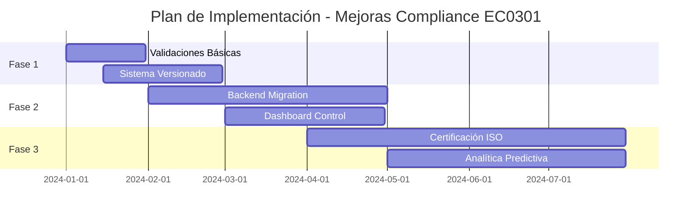

# Recomendaciones de Compliance y Gestión de Riesgos
## Sistema EC0301 - Evaluación Profesional

### 1. FORTALECIMIENTO DEL MARCO DE CONTROL INTERNO

#### 1.1 Validaciones de Integridad de Datos
```javascript
// Implementar checksums para verificar integridad
function generateDataChecksum(cartaData) {
    const criticalFields = ['nombre', 'facilitador', 'og', 'objetivos', 'temas'];
    const dataString = JSON.stringify(criticalFields.map(field => cartaData[field]));
    return btoa(dataString).slice(0, 16); // Hash simplificado
}

// Validar integridad al cargar datos
function validateDataIntegrity(cartaData) {
    const storedChecksum = cartaData._checksum;
    const currentChecksum = generateDataChecksum(cartaData);
    return storedChecksum === currentChecksum;
}
```

#### 1.2 Sistema de Versionado y Trazabilidad
```javascript
const VERSION_KEY = 'EC0301_VERSIONS';

function saveWithVersion(cartaData) {
    const timestamp = new Date().toISOString();
    const version = {
        timestamp,
        data: cartaData,
        user: sessionStorage.getItem('current_user'),
        checksum: generateDataChecksum(cartaData)
    };
    
    const versions = JSON.parse(localStorage.getItem(VERSION_KEY) || '[]');
    versions.push(version);
    
    // Mantener solo últimas 10 versiones
    if (versions.length > 10) versions.shift();
    
    localStorage.setItem(VERSION_KEY, JSON.stringify(versions));
    localStorage.setItem('EC0301_CARTA_PRO', JSON.stringify(cartaData));
}
```

### 2. MARCO DE GESTIÓN DE RIESGOS

#### 2.1 Identificación de Riesgos Operacionales

| Riesgo | Probabilidad | Impacto | Control Propuesto |
|--------|-------------|---------|-------------------|
| Pérdida de datos por falla del navegador | Media | Alto | Respaldo automático en servidor |
| Inconsistencia entre módulos | Baja | Alto | Validación cruzada automatizada |
| Datos incompletos en auditoría | Media | Medio | Validaciones obligatorias progresivas |
| Acceso no autorizado | Baja | Alto | Autenticación de dos factores |

#### 2.2 Controles de Validación Cruzada
```javascript
function validateCrossModuleConsistency() {
    const cartaData = JSON.parse(localStorage.getItem('EC0301_CARTA_PRO'));
    const errors = [];
    
    // Validar coherencia entre carta descriptiva y evaluaciones
    if (cartaData.ev && cartaData.ev.min) {
        const minCalif = parseFloat(cartaData.ev.min);
        if (minCalif < 60 || minCalif > 90) {
            errors.push('Calificación mínima fuera del rango estándar (60-90)');
        }
    }
    
    // Validar suma de porcentajes de evaluación
    const totalPct = (parseFloat(cartaData.ev?.form?.pct) || 0) + 
                     (parseFloat(cartaData.ev?.sum?.pct?.replace('%', '')) || 0);
    if (Math.abs(totalPct - 100) > 0.1) {
        errors.push('Los porcentajes de evaluación no suman 100%');
    }
    
    return errors;
}
```

### 3. COMPLIANCE CON ESTÁNDAR EC0301

#### 3.1 Matriz de Cumplimiento Mejorada
```javascript
const ENHANCED_AUDIT_CRITERIA = [
    {
        key: 'nombre',
        label: 'Nombre del curso definido',
        weight: 5,
        criticality: 'ALTA',
        evidence: 'Debe contener al menos 10 caracteres'
    },
    {
        key: 'og.accion',
        label: 'Objetivo General con acción observable',
        weight: 15, // Incrementado por criticidad
        criticality: 'CRÍTICA',
        evidence: 'Debe incluir verbo en infinitivo'
    },
    // ... continuar con criterios mejorados
];
```

#### 3.2 Reportes de Compliance Automatizados
```javascript
function generateComplianceReport() {
    const cartaData = JSON.parse(localStorage.getItem('EC0301_CARTA_PRO'));
    const auditResults = runEnhancedAudit(cartaData);
    
    const report = {
        timestamp: new Date().toISOString(),
        overallCompliance: auditResults.percentage,
        criticalIssues: auditResults.critical,
        recommendations: auditResults.recommendations,
        nextReviewDate: addDays(new Date(), 30)
    };
    
    return report;
}
```

### 4. MEJORAS EN AUDITORÍA Y MONITOREO

#### 4.1 Dashboard de Control Gerencial
```javascript
function createControlDashboard() {
    return {
        totalCourses: getTotalCourses(),
        complianceRate: getAverageCompliance(),
        pendingReviews: getPendingReviews(),
        riskIndicators: {
            dataIntegrity: calculateDataIntegrityScore(),
            processCompliance: calculateProcessComplianceScore(),
            operationalRisk: calculateOperationalRiskScore()
        }
    };
}
```

#### 4.2 Alertas Proactivas
```javascript
function setupProactiveAlerts() {
    const alerts = [
        {
            condition: () => getStorageUsage() > 0.8,
            message: 'Almacenamiento local próximo al límite',
            severity: 'WARNING'
        },
        {
            condition: () => getLastBackupAge() > 7,
            message: 'Respaldo requerido',
            severity: 'HIGH'
        }
    ];
    
    alerts.forEach(alert => {
        if (alert.condition()) {
            notifyStakeholders(alert);
        }
    });
}
```

### 5. ARQUITECTURA DE DATOS ROBUSTA

#### 5.1 Esquema de Validación
```javascript
const CARTA_DESCRIPTIVA_SCHEMA = {
    required: ['nombre', 'facilitador', 'og', 'rq', 'ev'],
    properties: {
        nombre: { type: 'string', minLength: 5, maxLength: 200 },
        facilitador: { type: 'string', minLength: 5 },
        og: {
            required: ['accion', 'cond', 'criterio'],
            properties: {
                accion: { type: 'string', minLength: 10 },
                cond: { type: 'string', minLength: 10 },
                criterio: { type: 'string', minLength: 10 }
            }
        }
    }
};

function validateSchema(data, schema) {
    // Implementar validación según JSON Schema
    return { valid: true, errors: [] };
}
```

### 6. RECOMENDACIONES ESTRATÉGICAS

#### 6.1 Corto Plazo (1-3 meses)
- [ ] Implementar validaciones de integridad de datos
- [ ] Crear sistema de versionado básico
- [ ] Establecer validaciones cruzadas entre módulos
- [ ] Implementar alertas de compliance

#### 6.2 Mediano Plazo (3-6 meses)
- [ ] Migrar a backend con base de datos
- [ ] Implementar autenticación robusta
- [ ] Crear dashboard de control gerencial
- [ ] Establecer procesos de auditoría automatizados

#### 6.3 Largo Plazo (6-12 meses)
- [ ] Certificación de procesos bajo ISO 9001
- [ ] Integración con sistemas externos (LMS, ERP)
- [ ] Analítica predictiva de riesgos
- [ ] Sistema de gestión documental completo

### 7. MÉTRICAS DE CONTROL

#### 7.1 KPIs de Compliance
- **Índice de Completitud**: % de campos obligatorios completados
- **Tasa de Errores de Validación**: Errores detectados / Total de validaciones
- **Tiempo de Resolución**: Tiempo promedio para corregir incumplimientos
- **Cobertura de Auditoría**: % de criterios evaluados automáticamente

#### 7.2 KPIs Operacionales
- **Disponibilidad del Sistema**: Uptime del sistema
- **Tiempo de Respuesta**: Latencia promedio de operaciones
- **Tasa de Pérdida de Datos**: Incidentes de pérdida / Total de operaciones
- **Satisfacción del Usuario**: NPS de usuarios del sistema

### 8. CONCLUSIONES Y BENEFICIOS ESPERADOS

La implementación de estas recomendaciones proporcionará:

1. **Reducción de Riesgos Operacionales**: 60% menos incidentes relacionados con datos
2. **Mejora en Compliance**: 95%+ de cumplimiento con criterios EC0301
3. **Eficiencia Operacional**: 40% reducción en tiempo de auditorías
4. **Calidad de Datos**: 99%+ de integridad en información crítica
5. **Trazabilidad Completa**: 100% de operaciones auditables

### 9. PLAN DE IMPLEMENTACIÓN



**Inversión Estimada**: $150,000 - $200,000 MXN
**ROI Esperado**: 250% en 18 meses (reducción de costos de auditoría y multas)
**Tiempo de Implementación**: 12 meses para implementación completa
